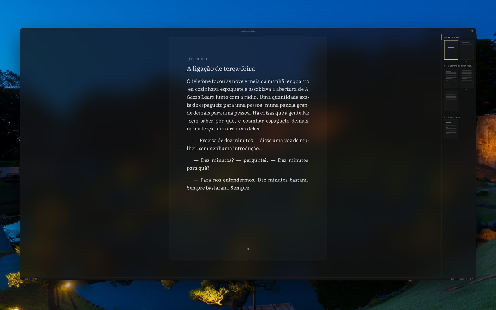

<p align="center">
    
    <p align="center">
        A translucent A5 book editor for macOS
    </p>
</p>

<br>

<p align="center">
    
</p>

mbook is a single, focused window for writing books. You write plain markdown
and mbook renders a real book around it: true-size A5 pages with folios and
running chapter headers, a composed title page, auto-numbered chapters, and a
navigator rail of page thumbnails — all on translucent chrome that lets your
desktop breathe through.

## Development

Want to hack on mbook? Just make sure you have [Bun](https://bun.sh/docs/installation) installed.

### Installing the local deps

Clone the project and run:

```sh
bun install
```

### Run mbook

```sh
bun run dev
```

The app launches with hot reload for the renderer.

### Tests and checks

```sh
bun test            # book domain test suite
bun run typecheck   # type-check main + renderer
```

### Packaging

```sh
bun run dist        # signature-less .dmg and .zip into release/
```

## Writing conventions

| You type | mbook renders |
| --- | --- |
| `#` heading | the title page — title and frontmatter author on their own A5 page |
| `##` heading | a chapter — just the name; mbook numbers it (`Capítulo N`) |
| `---` on its own line | separator ornament |
| `**bold**` / `*italic*` | true Literata weights and italics; the marks lift while you write |
| `> quote` | a set extract — inset from both edges, a step smaller |
| `-> text <-` | a centred line — dedications, epigraph credits, part marks |
| `--` then a letter | `—` travessão |
| straight quotes `"` `'` | smart quotes, automatically |
| `title:` / `author:` frontmatter | collapsed title · author strip |

Frontmatter lives at the top of the file between `---` fences; it collapses to
a small-caps strip unless the cursor is inside it.

## The page

The manuscript renders as discrete A5 sheets (148 × 210 mm at 100%): 19 mm
head and 22 mm foot margins, folio at the foot of every page after the
half-title, the chapter's name as a running header. Page breaks come from a
pure screen-true estimate of the A5 text block — honest, block-granular, and
live in the status bar as you write.

## Chrome

| Keys | |
| --- | --- |
| `⌘\` | toggle the navigator rail (chapters + page thumbnails; drag its edge to resize) |
| `⌘+` / `⌘-` / `⌘0` | zoom the page 50–200% without reflowing a single line |
