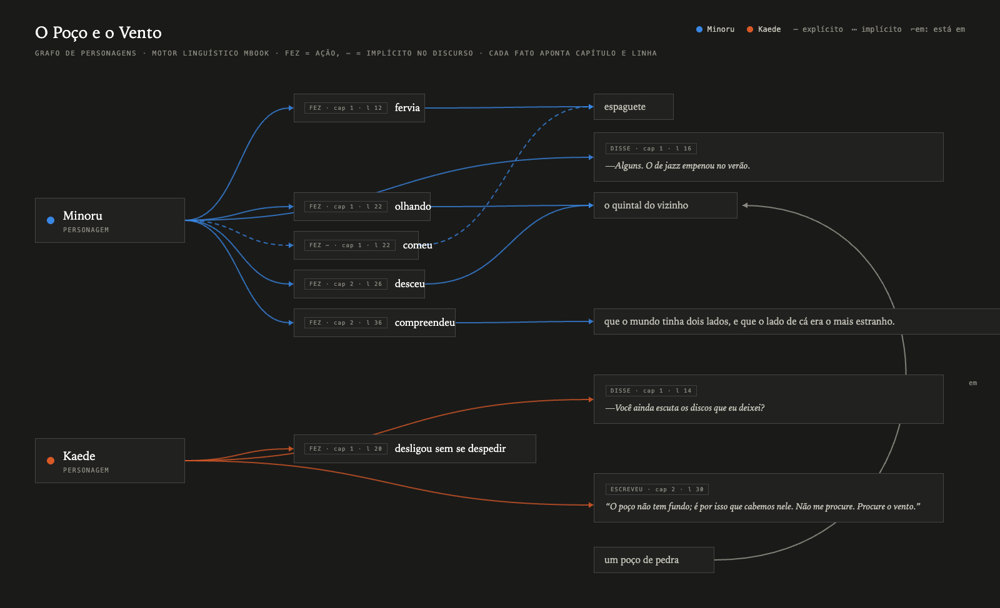
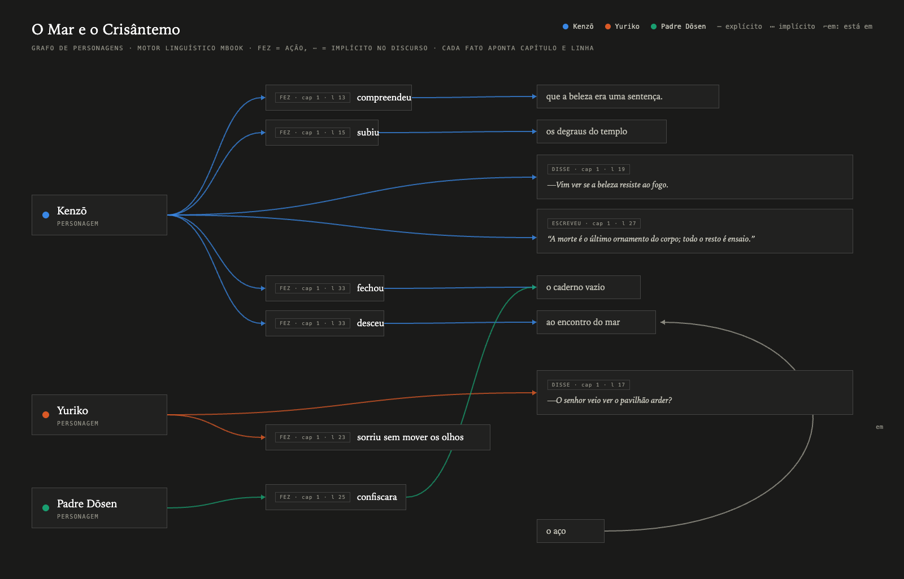

<p align="center">
    
    <p align="center">
        A translucent A5 book editor for macOS
    </p>
</p>

<br>

<p align="center">
    
</p>

mbook is a single, focused window for writing books. You write plain markdown
and mbook renders a real book around it: true-size A5 pages with folios and
running chapter headers, a composed title page, auto-numbered chapters, and a
navigator rail of page thumbnails — all on translucent chrome that lets your
desktop breathe through.

## The book that reads itself

<p align="center">
    
</p>

While you write, mbook parses the manuscript with a real linguistic engine —
no cloud, no model, just dictionaries and grammar. A 1.2M-entry Brazilian
Portuguese lexicon (Unitex-PB DELAF) and a 485k-entry English one
(AGID + Moby + VarCon) ship compiled into the app; every save is tokenized,
tagged, chunked and read for relations:

- **Who did what.** Subjects, objects, copular predicates, clausal
  complements — `compreendeu que o mundo tinha dois lados`.
- **What was done, and by whom.** Passives find their agents: in
  `a cidade foi tomada pela espiral`, the spiral did it.
- **Which stairs? From where?** Genitive chains qualify every thing
  (`os degraus do templo`), relative clauses hand verbs their antecedents
  (`o caderno que o sacerdote confiscara` — he confiscated *the notebook*),
  and place relatives locate one thing in another
  (`o quintal, onde um poço esperava` — the well is in the yard).
- **What went unsaid.** An elided object resolves across sentences:
  *"O espaguete passou do ponto. Minoru comeu assim mesmo."* — the engine
  knows what he ate. That's the dashed edge above.
- **Who is speaking.** Dialogue lines and written quotes attribute to the
  cast, so every voice on the page has an owner.

Characters are declared once in frontmatter and bound in prose with light
glyphs — visible when you want a name on the page, silent when you don't:

| You type | mbook understands |
| --- | --- |
| `character: Minoru` in frontmatter | Minoru joins the cast |
| `@[Minoru] desceu ao quintal` | a visible mention, pinned as that sentence's subject |
| `{a mulher do telefone}[Kaede]` | display text of your choosing, bound to Kaede at the point of use |
| `—[Kaede] Você ainda escuta…` | a dialogue line, spoken by Kaede |
| `“[Kenzō] A morte é o último ornamento…”` | a written quote, in Kenzō's hand |

<p align="center">
    
</p>

Every fact is grounded — chapter and line — because it came from your
sentences, not from a guess. Both graphs above were produced by the engine
alone, from the two demo manuscripts, with no hand labeling. Analysis runs
off the save path into a local SQLite database, so the editor never waits
for it.

## Development

Want to hack on mbook? Just make sure you have [Bun](https://bun.sh/docs/installation) installed.

### Installing the local deps

Clone the project and run:

```sh
bun install
```

### Run mbook

```sh
bun run dev
```

The app launches with hot reload for the renderer.

### Tests and checks

```sh
bun test            # book domain test suite
bun run typecheck   # type-check main + renderer
```

### Packaging

```sh
bun run dist        # signature-less .dmg and .zip into release/
```

## Writing conventions

| You type | mbook renders |
| --- | --- |
| `#` heading | the title page — title and frontmatter author on their own A5 page |
| `##` heading | a chapter — just the name; mbook numbers it (`Capítulo N`) |
| `---` on its own line | separator ornament |
| `**bold**` / `*italic*` | true Literata weights and italics; the marks lift while you write |
| `> quote` | a set extract — inset from both edges, a step smaller |
| `-> text <-` | a centred line — dedications, epigraph credits, part marks |
| `--` then a letter | `—` travessão |
| straight quotes `"` `'` | smart quotes, automatically |
| `title:` / `author:` frontmatter | collapsed title · author strip |

Frontmatter lives at the top of the file between `---` fences; it collapses to
a small-caps strip unless the cursor is inside it.

## The page

The manuscript renders as discrete A5 sheets (148 × 210 mm at 100%): 19 mm
head and 22 mm foot margins, folio at the foot of every page after the
half-title, the chapter's name as a running header. Page breaks come from a
pure screen-true estimate of the A5 text block — honest, block-granular, and
live in the status bar as you write.

## Chrome

| Keys | |
| --- | --- |
| `⌘K` | the command bar — jump to any chapter, toggle the rail, zoom, open recent books |
| `⌘\` | toggle the navigator rail (chapters + page thumbnails; drag its edge to resize) |
| `⌘+` / `⌘-` / `⌘0` | zoom the page 50–200% without reflowing a single line |
